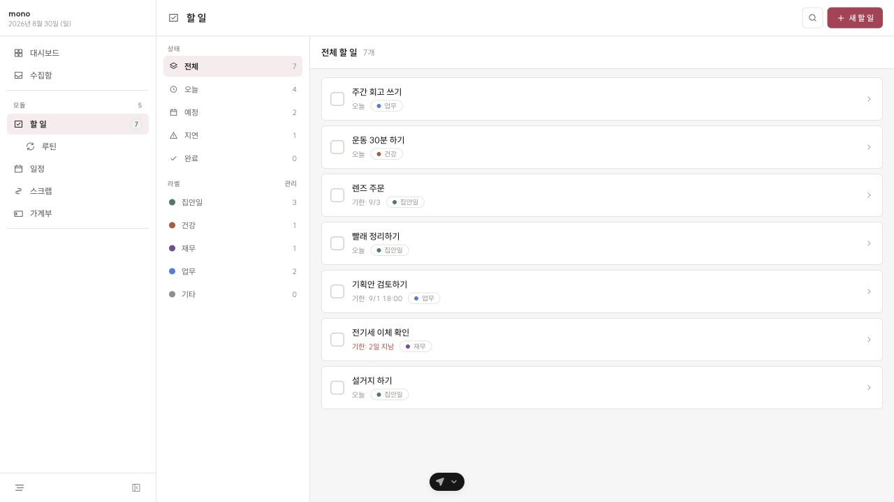
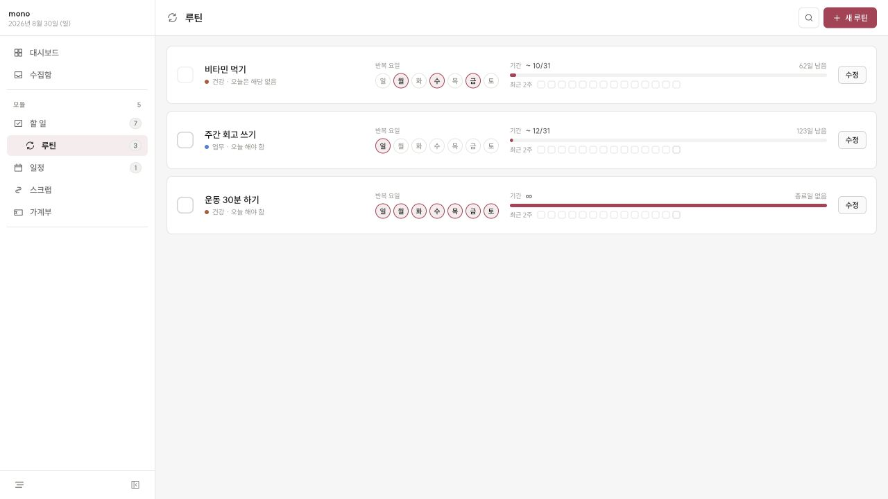
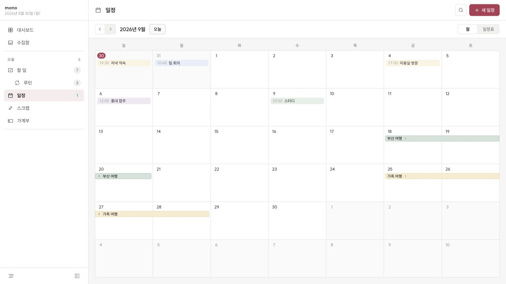
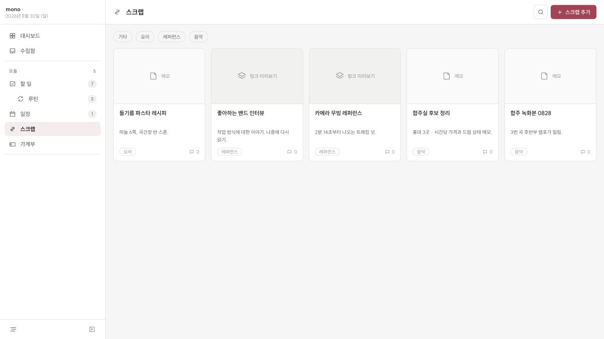
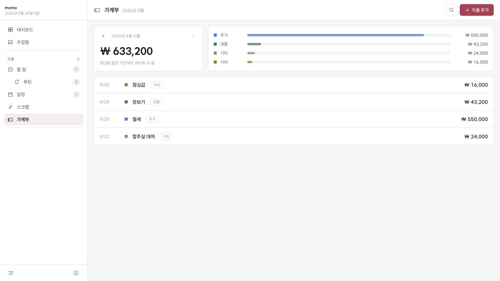
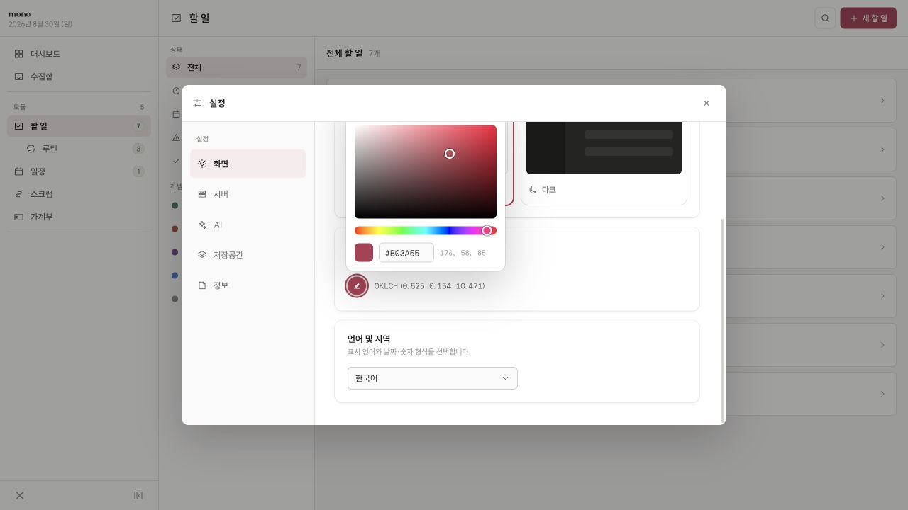

<a href="./README_KR.md">한국어</a>

# mono

A calm personal workspace for tasks, routines, schedules, scraps, and spending.

## Todo

- Filter tasks by status and label.
- Set due dates, times, and notes.
- See scheduled routines alongside one-off tasks.

## Routine

- Repeat routines on selected weekdays, indefinitely or until a date.
- Mark today's routine complete and review recent activity.

## Calendar

- Switch between month and agenda views.
- Create timed, all-day, multi-day, and recurring events.
- Organize events with custom labels.

## Scrap

- Keep notes, links, images, and videos in one place.
- Organize scraps with tags and add comments for context.

## Ledger

- Record expenses by date and category.
- See monthly totals and category breakdowns at a glance.

## Appearance

- Choose any accent color for the entire app.

